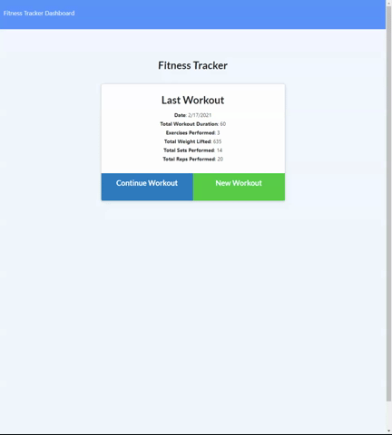

# fitness-tracker

Welcome to your personal fitness tracker! This application will help you keep track of your workouts by letting you input exercises every day. It also will accept workout stats such as duration, number of reps, number of sets, weight lifted, and keep a running total of all your exercises performed. Each day is tracked separetely and a graph of your efforts over the last seven days is also available!



## Table of Contents

| |||
|:-|:-|:-|
| [Project Introduction](#fitness-tracker) | [Table of Contents](#table-of-contents) | [Goals and Methods](#goals-and-methods) 
| [Deployed Link](#deployed-link) | [Technologies](#technologies) | [Author](#author) 
| [Acknowledgments](#acknowledgments) | [License](#license) |
---

## Goals and Methods

The primary goal of this build was to continue practicing building MVC full stack applications. This time around I used MongoDB and Mongoose.js for the database. The site is deployed to Heroku which required setting up MongoDB in Atlas. A feature of note for the project is the Mongoose data model. This implementation of the data allows is flexible as many kinds of workouts can be captured:
```javascript
const WorkoutSchema = new Schema({
day: {
  type: Date,
  // unique: true,
  required: "Enter a date for workout"
},
exercises: [
    {
    type: {
      type: String,
      enum: ["resistance", "cardio"],
      required: "Enter a workout type"
    },
    name: {
      type: String,
      required: "Enter an excercise name"
```

## Deployed Link

[Deployed to Heroku](https://cryptic-woodland-44713.herokuapp.com/)

## Technologies 

||||
|:-:|:-:|:-:|
|[Node.js](https://nodejs.org/en/)|[Express](https://expressjs.com/)|[MongoDB](https://www.mongodb.com/) 
|[mongoose](https://mongoosejs.com/)|[dotenv](https://www.npmjs.com/package/dotenv)

## Author

Coleman Buffa

* [Git Hub](https://github.com/coleman-buffa/fitness-tracker)
* [My Portfolio](https://colemanbuffa-portfolio.herokuapp.com/)
* [LinkedIn](https://www.linkedin.com/in/coleman-buffa/)

## Acknowledgments

My thanks to the many mentors and friends who are a constant source of project ideas, learning topics, and guidance.

## License

[](https://opensource.org/licenses/MIT)

### [Back to Table of Contents](#table-of-contents)